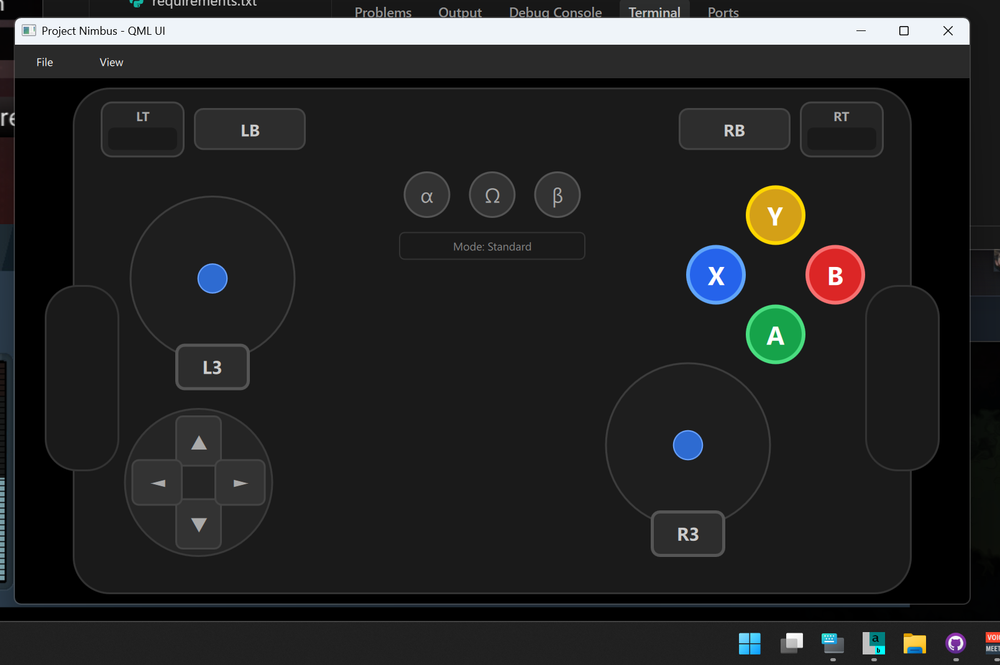
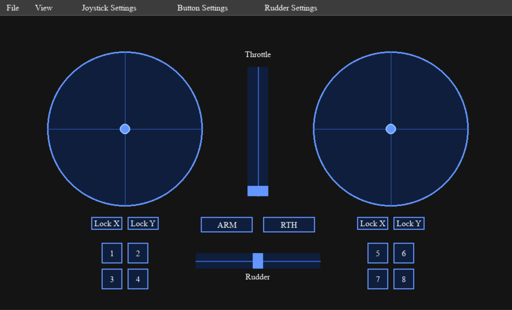
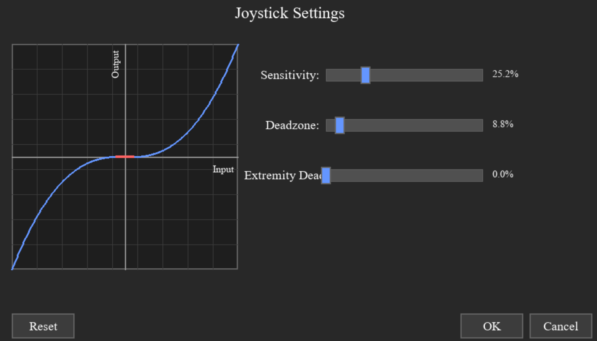
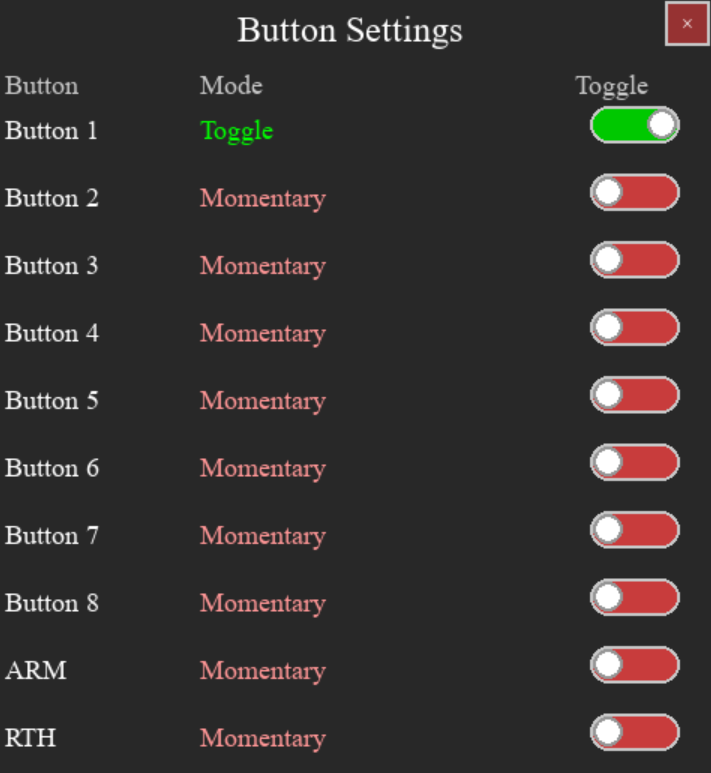

<div align="center">
  
</div>

# Project Nimbus

Project Nimbus is a Python-based virtual controller interface that transforms mouse input into virtual joystick commands via the vJoy driver. It provides multiple controller layouts including a comprehensive dual-joystick Flight Simulator layout, Xbox-style gamepad layout, and an accessibility-focused Adaptive Platform layout.

It is designed with accessibility in mind, offering a practical solution for individuals with mobility limitations who may not be able to use traditional physical controllers. By providing a mouse-first input model, it enables users to interact with systems that expect joystick input.

At the same time, Project Nimbus is versatile enough for anyone interested in alternative control schemes. Whether for adaptive gaming, connecting to Mission Planner for UAV and rover control, or playing games via Steam Input, Nimbus makes joystick input more flexible and inclusive.

## Adaptive Platform Profile

<div align="center">
  
  <p><em>Adaptive Platform 1 profile with accessibility-focused design: larger buttons, Greek symbols (α, Ω, β), and prominent L3/R3 stick click buttons</em></p>
</div>

## Screenshots

<div align="center">
  
  <p><em>Main interface showing dual joysticks, throttle, rudder, and configurable buttons with menu bar</em></p>
</div>

<div align="center">
  
  <p><em>Joystick Settings dialog with real-time sensitivity curve visualization, deadzone, and extremity deadzone controls</em></p>
</div>

<div align="center">
  
  <p><em>Button Settings dialog showing toggle/momentary mode configuration with color-coded visual feedback</em></p>
</div>

## Features

### Core Functionality
- **Multiple Controller Layouts**: Flight Simulator (dual joysticks + throttle/rudder), Xbox (gamepad), and Adaptive Platform (accessibility-focused)
- **Dual Virtual Joysticks**: Left and right joystick controls with independent axis mapping
- **Throttle & Rudder Controls**: Dedicated vertical throttle slider and horizontal rudder slider
- **Button Support**: Configurable buttons (A, B, X, Y, LB, RB, LT, RT, L3, R3, D-Pad, View, Menu, Guide) with VJoy integration
- **Real-time Control**: Low-latency input processing with 60 FPS update rate
- **VJoy Integration**: Direct communication with vJoy driver for seamless compatibility
- **Steam Input Support**: Works with Steam Input for XInput-compatible games

### Advanced Configuration
- **Axis Mapping Dialog**: Configure which VJoy axes each control maps to
- **Joystick Sensitivity Settings**: Adjustable response curves with visual feedback and real-time graph display
- **Rudder Sensitivity Settings**: Dedicated sensitivity curves for rudder control with deadzone configuration
- **Button Mode Configuration**: Toggle between momentary and toggle modes for each button individually
- **Individual Axis Locking**: Lock X or Y axes independently on each joystick
- **Auto-centering**: Configurable auto-center behavior for rudder control
- **JSON Configuration**: Persistent settings stored in `controller_config.json`

### Profile System
- **Multiple Profiles**: Switch between different controller layouts (Flight Simulator, Xbox Controller, Adaptive Platform, custom)
- **Per-Profile Settings**: Each profile stores its own joystick sensitivity, rudder sensitivity, and button toggle modes
- **Automatic Save**: Changes made in settings dialogs are automatically saved to the current profile
- **Save Profile As**: Create new profiles with custom names and descriptions
- **Reset to Defaults**: Restore built-in profiles to original settings
- **Portable Profiles**: JSON-based profiles stored in user data directory for easy backup
- **Layout Types**: Each profile specifies its layout type (flight_sim, xbox, or adaptive)

### User Interface
- **Qt Quick (PySide6 QML) UI**: Dark-themed, resizable interface with smooth animations
- **Menu System**: File menu for configuration dialogs; View menu with Size presets and Debug Borders
- **Proportional Scaling**: All UI elements scale via `controller.scaled()` and View > Size presets; preference persists
- **Status Display**: VJoy connection status and real-time value monitoring
- **Keyboard Shortcuts**: ESC to exit, SPACE to center
- **Game Focus Mode**: Prevents Project Nimbus from stealing focus from games (Windows only)

## Accessibility

The project was built with an accessibility-first philosophy. Instead of assuming users can handle conventional joysticks or gamepads, Nimbus allows mouse-driven or alternative inputs to control any software or hardware that supports vJoy.

This makes it especially valuable for:
- **Users with mobility impairments** who rely on mouse or adaptive devices
- **Developers creating assistive technology** solutions
- **Hobbyists and researchers** exploring human-computer interaction through unconventional inputs
- **Anyone seeking alternative control schemes** for specialized applications

## Applications

- **UAV and Rover Control**: Bridge mouse input to Mission Planner and other MAVLink-compatible ground control software with professional-grade stability features
- **Adaptive Gaming**: Play joystick-only games using a mouse-first input scheme with customizable sensitivity
- **Research and Prototyping**: Explore new input models for robotics, simulation, or accessibility tools with comprehensive configuration options
- **Assistive Technology**: Provide joystick functionality for users who cannot operate traditional controllers
- **Borderless Gaming**: Use Project Nimbus alongside borderless gaming for seamless full-screen gaming with simultaneous mouse and joystick control

## Borderless Gaming Integration

Project Nimbus works seamlessly in conjunction with **borderless gaming mode**. When your game runs in borderless fullscreen, you can position Project Nimbus alongside it to achieve:

- **Simultaneous Mouse & Joystick Control**: Use your mouse for in-game interactions (menus, cursor control) while your joysticks handle flight/movement controls
- **Seamless Multitasking**: Alt-Tab between your game and Project Nimbus without losing input control
- **Flight Simulator Integration**: Perfect for Microsoft Flight Simulator 24 and similar titles where you need mouse control for cockpit interactions and joysticks for flight control
- **Driving Game Support**: Control steering with joysticks while using the mouse for menus, map navigation, or other UI elements

**How to Use**:
- Launch your game in borderless fullscreen mode
- Run Project Nimbus as a separate window
- Position the windows side-by-side or use Alt+Tab to switch between them
- All controls remain fully functional with full mouse freedom across both windows

## Game Focus Mode (Windows)

When playing games that pause or lose input when unfocused, enable **Game Focus Mode** to keep your game running while interacting with Project Nimbus.

**How it works:**
1. Go to **View > Game Focus Mode** to enable
2. When you click on Project Nimbus, it briefly takes focus to register your input
3. When you release the mouse, focus is automatically restored to the previous window (your game)

**Technical details:**
- Uses Windows API (`SetForegroundWindow` with `AttachThreadInput`) to restore focus
- Works with most games, though some that pause instantly on focus loss may still notice the brief switch
- Setting is saved and persists across sessions

**Note:** This feature is only available on Windows. On other platforms, the menu option will be disabled.

## Installation

### Option 1: Standalone Executable (Recommended for End Users)

1. **Download the latest release**:
   - Go to [Releases](https://github.com/owenpkent/Project-Nimbus/releases)
   - Download `Project-Nimbus.exe` from the latest release

2. **Install VJoy Driver**:
   - Download and install from [VJoy Official Site](http://vjoystick.sourceforge.net/)
   - Configure VJoy device #1 with at least 6 axes (X, Y, Z, RX, RY, RZ)
   - Ensure VJoy device is enabled and available

3. **Run the application**:
   - Double-click `Project-Nimbus.exe`
   - No Python installation required!

### Option 2: Run from Source (For Developers)

#### Prerequisites
1. **Python 3.8+** - Required for the application
2. **VJoy Driver** - Download and install from [VJoy Official Site](http://vjoystick.sourceforge.net/)
3. **Git** (optional) - For cloning the repository

#### Setup Instructions

1. **Clone or download the project**:
   ```bash
   git clone https://github.com/owenpkent/Project-Nimbus.git
   cd Project-Nimbus
   ```

2. **Install Python dependencies**:
   ```bash
   pip install -r requirements.txt
   ```

3. **Configure VJoy**:
   - Install VJoy driver
   - Configure VJoy device #1 with at least 6 axes (X, Y, Z, RX, RY, RZ)
   - Ensure VJoy device is enabled and available

4. **Run the application (Qt Quick UI)**:
   ```bash
   python run.py
   ```
   
   Notes:
   - The Qt Quick (QML) UI is the default and primary UI.
   - Settings persist via `controller_config.json`.

### Building Your Own Executable

See [build_tools/BUILD_EXECUTABLE.md](build_tools/BUILD_EXECUTABLE.md) for detailed instructions on creating a standalone Windows executable using PyInstaller.

## Usage

### Basic Controls
- **Mouse Drag**: Click and drag within joystick circles to control position
- **Throttle Slider**: Vertical slider for throttle control (does not auto-center)
- **Rudder Slider**: Horizontal slider for rudder control (auto-centers when released)
- **Lock Buttons**: Click "Lock X" or "Lock Y" to lock individual axes on each joystick
- **Joystick Buttons**: 8 configurable buttons (1-4 on left, 5-8 on right) with toggle/momentary modes
- **ARM Button**: Configurable ARM button (button 9) with toggle/momentary mode
- **RTH Button**: Configurable Return to Home button (button 10) with toggle/momentary mode

### Menu System
- **File > Profile**: Switch between profiles (Flight Simulator, Adaptive Platform, custom)
- **File > Save Profile / Save Profile As...**: Save current settings to profile
- **File > Settings**: Consolidated settings submenu
  - **Joystick Sensitivity**: Configure sensitivity curves for joysticks
  - **Throttle/Rudder or Trigger Sensitivity**: Profile-aware slider/trigger settings
  - **Axis Mapping**: Assign UI controls to VJoy axes (labels adapt to profile)
  - **Button Modes**: Configure toggle/momentary modes for buttons

### Keyboard Shortcuts
- **ESC**: Exit application (or close open dialogs)
- **F1**: Toggle debug information display
- **SPACE**: Center both joysticks
- **C**: Open axis configuration dialog

### Status Indicators
- **VJoy Connection**: Shows VJoy driver connection status in real-time
- **Real-time Values**: Current joystick positions and processed values
- **Lock Status**: Visual indicators showing which axes are locked

## Profiles

Project Nimbus uses a profile system to save and manage different controller configurations. Each profile stores its own sensitivity curves, deadzones, button settings, and layout type.

### Profile Storage Location

Profiles are stored in your user data directory for easy access and backup:

| Platform | Location |
|----------|----------|
| **Windows** | `%APPDATA%\ProjectNimbus\profiles\` |
| **macOS** | `~/Library/Application Support/ProjectNimbus/profiles/` |
| **Linux** | `~/.local/share/ProjectNimbus/profiles/` |

**Quick Access**: Use **File > Open Profiles Folder...** to open the profiles directory in your file explorer.

### Profile Files

Each profile is a JSON file containing:
- **name**: Display name shown in the menu
- **description**: Optional description of the profile
- **layout_type**: UI layout (`flight_sim`, `xbox`, or `adaptive`)
- **joystick_settings**: Sensitivity, deadzone, extremity deadzone
- **rudder_settings**: Rudder-specific sensitivity settings
- **buttons**: Button labels and toggle modes
- **axis_mapping**: VJoy axis assignments

### Backing Up Profiles

To back up your profiles:
1. Open **File > Open Profiles Folder...**
2. Copy the `.json` files to your backup location
3. To restore, copy them back to the profiles folder

### Built-in Profiles

Three profiles are included by default:
- **Flight Simulator**: Optimized for flight sims with throttle/rudder layout
- **Xbox Controller**: Standard Xbox gamepad layout with ABXY buttons and triggers
- **Adaptive Platform 1**: Accessibility-focused layout with larger buttons, Greek symbols (α, Ω, β), and prominent L3/R3 stick click buttons

Built-in profiles can be customized and saved, then reset to defaults at any time using **File > Reset Profile to Defaults**.

## Configuration

The application uses a JSON-based configuration system stored in `controller_config.json`. The configuration is automatically created with sensible defaults on first run.

### Key Configuration Sections

#### Joystick Settings
```json
{
  "joysticks": {
    "left": {
      "dead_zone": 0.1,
      "sensitivity": 1.0,
      "curve_type": "linear",
      "curve_power": 2.0,
      "invert_x": false,
      "invert_y": false,
      "max_range": 1.0
    }
  }
}
```

#### Safety Settings
```json
{
  "safety": {
    "enable_failsafe": true,
    "failsafe_timeout": 5.0,
    "max_update_rate": 100,
    "enable_smoothing": true,
    "smoothing_factor": 0.1
  }
}
```

### Settings Dialogs

#### Joystick Settings
The Joystick Settings dialog provides comprehensive control over joystick response:
- **Sensitivity (0-100%)**: Controls the steepness of the response curve
  - 50% = Linear response
  - <50% = Flatter curve (less sensitive, more precise)
  - >50% = Steeper curve (more sensitive, faster response)
- **Deadzone (0-100%)**: Creates a dead area around center where small movements are ignored
- **Extremity Deadzone (0-100%)**: Prevents reaching absolute maximum values at the edges
- **Real-time Graph**: Visual representation of the sensitivity curve with deadzone indicators

#### Rudder Settings
Identical functionality to Joystick Settings but specifically for rudder control:
- Independent sensitivity curve configuration
- Separate deadzone and extremity deadzone settings
- Real-time visual feedback of the response curve
- Settings are applied immediately to rudder input

#### Button Settings
Configure the behavior of all 10 buttons:
- **Toggle Mode**: Button stays "pressed" until clicked again (green indicator)
- **Momentary Mode**: Button is only active while being held down (red indicator)
- **Visual Feedback**: Color-coded switches show current mode at a glance
- **Individual Configuration**: Each button (1-8, ARM, RTH) can be set independently

### Sensitivity Curves
The sensitivity curve system provides precise control over input response:
- **Linear (50%)**: Direct 1:1 response
- **Flatter Curves (<50%)**: More precise control near center, exponential scaling
- **Steeper Curves (>50%)**: Faster response near center, logarithmic scaling
- **Deadzone Integration**: Curves work seamlessly with deadzone settings
- **Real-time Preview**: See exactly how your settings affect the response curve

## Architecture

### Project Structure
```
Project-Nimbus/
├── qml/                           # QML UI (Qt Quick)
│   ├── Main.qml                   # Main window, menus, and layout
│   └── components/                # Reusable QML controls
│       ├── Joystick.qml
│       ├── SliderVertical.qml     # Throttle (vertical)
│       └── SliderHorizontal.qml   # Rudder (horizontal)
├── src/
│   ├── qt_qml_app.py              # QML application entry (QQmlApplicationEngine)
│   ├── bridge.py                  # Python↔QML bridge (ControllerBridge)
│   ├── qt_dialogs.py              # Qt Widgets dialogs used by QML (Axis/Joystick/Rudder/Buttons)
│   ├── vjoy_interface.py          # VJoy driver interface
│   ├── config.py                  # Configuration management
│   └── legacy/                    # Legacy pygame-based UI/dialogs retained for reference only
├── build_tools/                   # Executable build system
│   ├── build_exe.bat              # Automated build script
│   ├── Project-Nimbus.spec        # PyInstaller configuration
│   ├── launcher.py                # GUI-friendly entry point for executable
│   ├── BUILD_EXECUTABLE.md        # Build documentation
│   └── README.md                  # Build tools documentation
├── run.py                         # Launcher with dependency checks
├── requirements.txt               # Python dependencies
├── controller_config.json         # Persistent settings (auto-generated)
├── logo.png
├── screenshots/
├── tests/
└── README.md
```

### Recent Changes (QML Migration)
- Migrated UI to Qt Quick (PySide6 QML) with a dark top menu bar.
- Standardized sizes using `controller.scaled(...)` for consistent, DPI-aware scaling.
- Joystick, throttle, rudder input behavior:
  - No jump-to-click; dragging is relative.
  - Joystick and rudder smoothly return to center on release; throttle does not auto-center.
- Throttle widened; rudder taller; refined animations.
- NumberPad and ARM/RTH buttons use dark styling with blue pressed/checked state.
- Optional debug borders for layout tuning.

### Key Components

#### `VJoyInterface`
Manages communication with the VJoy driver including:
- Device initialization and management
- Axis value updates
- Failsafe monitoring
- Error handling and recovery

#### `ControllerConfig`
Configuration management system providing:
- JSON-based configuration storage
- Sensitivity curve processing
- Dead zone calculations
- Configuration validation

## Safety Features

### Failsafe System
- **Automatic Activation**: Triggers if no commands received within timeout period
- **Emergency Stop**: Manual emergency stop button
- **Axis Centering**: Automatically centers all axes during failsafe
- **Visual Indicators**: Clear status display when failsafe is active

### Rate Limiting
- **Update Rate Control**: Prevents excessive update rates
- **Safety Limits**: Hard limits on maximum update frequency
- **Smooth Operation**: Ensures stable operation under all conditions

### Error Handling
- **VJoy Connection Monitoring**: Continuous monitoring of VJoy driver status
- **Graceful Degradation**: Continues operation even if VJoy is unavailable
- **Comprehensive Logging**: Detailed error reporting and status information

## Troubleshooting

### Common Issues

#### VJoy Not Detected
- Ensure VJoy driver is properly installed
- Check that VJoy device #1 is configured and enabled
- Verify VJoy device has sufficient axes configured
- Run application as administrator if needed

#### Poor Responsiveness
- Check `update_rate` setting in configuration
- Reduce `smoothing_factor` for more responsive control
- Verify system performance and close unnecessary applications

#### Joystick Drift
- Increase `dead_zone` values in configuration
- Check for hardware interference (other controllers)
- Verify mouse sensitivity settings

### Debug Mode
Press F1 to enable debug mode, which displays:
- Current configuration values
- Update rates and timing information
- Detailed joystick position data
- VJoy driver status

## Development

### Code Style
- **PEP 8 Compliance**: All code follows Python PEP 8 style guidelines
- **Type Hints**: Comprehensive type annotations for better code clarity
- **Documentation**: Detailed docstrings for all classes and methods
- **Error Handling**: Robust error handling throughout the application

### Testing
- **Configuration Validation**: Built-in configuration validation
- **Failsafe Testing**: Comprehensive failsafe system testing
- **Edge Case Handling**: Proper handling of edge cases and error conditions

### Extension Points
- **Custom Sensitivity Curves**: Easy to add new curve types
- **Additional Input Methods**: Framework supports multiple input types
- **Plugin Architecture**: Modular design allows for easy extensions

## Alternative Shell

An optional Qt Widgets-based shell is available for experimentation:

- `src/qt_main.py`: Alternative interface implemented with Qt Widgets. It is not used by the default launcher and is not maintained at feature parity with the QML UI. The primary UI remains the Qt Quick (QML) app launched via `run.py`.

## Legacy
Legacy pygame-based UI and dialogs are kept under `src/legacy/` for reference only and are not used by the QML app launched via `run.py`.

## Changelog (recent)

### v2.1 - Profile-Specific Settings & Menu Redesign
- **Profile-Specific Settings**: Joystick sensitivity, slider sensitivity, and button toggle modes are now saved per-profile instead of globally
  - Each profile stores its own `joystick_settings`, `rudder_settings`, and button `toggle_mode` configurations
  - Switching profiles automatically loads that profile's settings
  - Settings dialogs (Joystick, Slider, Button, Axis Mapping) now persist changes to the current profile
- **Consolidated Settings Menu**: All settings now under `File > Settings` submenu with clearer organization:
  - `Joystick Sensitivity...` - Sensitivity curves for joysticks
  - `Throttle/Rudder Sensitivity...` or `Trigger Sensitivity...` (profile-aware label)
  - `Axis Mapping...` - Map UI controls to VJoy axes
  - `Button Modes...` - Toggle/momentary button behavior
- **Profile-Aware Labels**: Axis mapping and settings dialogs show context-appropriate names:
  - Flight Sim: "Throttle", "Rudder"
  - Adaptive Platform: "Left Trigger (LT)", "Right Trigger (RT)"
- **Profiles Menu in Qt Widgets Shell**: Added Profiles menu to the alternative Qt shell for profile switching
- **Qt Widgets Shell Warning**: Running `qt_main.py` directly now displays a warning directing users to use `run.py`

### v2.0 - Adaptive Platform & Steam Input Support
- **New Adaptive Platform Profile**: Accessibility-focused layout with larger buttons, Greek symbols (α, Ω, β), and prominent L3/R3 stick click buttons
- **Steam Input Integration**: vJoy now works with Steam Input for XInput-compatible games like No Man's Sky
- **Dynamic Layout Switching**: Profiles now support multiple layout types (flight_sim, xbox, adaptive) that dynamically load the appropriate QML layout
- **Improved Profile System**: Profiles stored in user data directory with automatic copying from bundled defaults
- **Button Enhancements**: Full Xbox controller button support (A, B, X, Y, LB, RB, LT, RT, L3, R3, D-Pad, View, Menu, Guide)
- **Menus**: Safe dark top menu bar; native popups for reliability; menus close immediately on selection
- **View menu**: Debug Borders toggle for UI layout tuning
- **Axis mapping**: Defaults for Throttle=Z and Rudder=RZ so Configure Axes shows correct mappings
- **Buttons**: QML now reacts to Button Settings changes (new `controller.buttonsVersion`); buttons unlatch automatically when switching from toggle to momentary
- **Curves**: Runtime uses the same math as the Joystick/Rudder Settings dialogs for consistent feel with previews
- **Smoothing**: QTimer-based interpolation of vJoy axes towards targets so sticks/rudder glide smoothly back to center on release
- **Joystick UI**: Thumb constrained to the circle using an effective radius; base circle layout fixed; Y-axis inverted per preference
- **Flight Sim Improvements**: Responsive button sizing that scales with window height; wider rudder slider with optional center-lock toggle button

## License

This project is licensed under the MIT License - see the LICENSE file for details.

## Contributing

1. Fork the repository
2. Create a feature branch
3. Make your changes with proper documentation
4. Add tests for new functionality
5. Submit a pull request

## Support

For issues, questions, or contributions, please refer to the project's issue tracker or documentation.

---

**Note**: This software is designed for educational and development purposes. When using for actual drone control, always follow proper safety protocols and local regulations.
