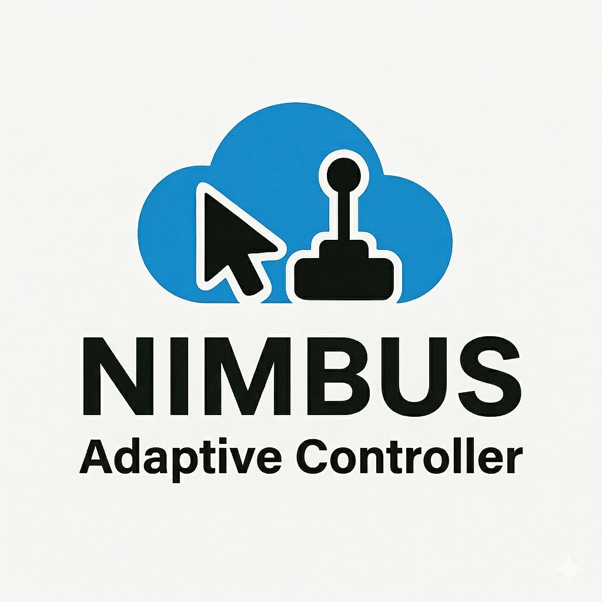
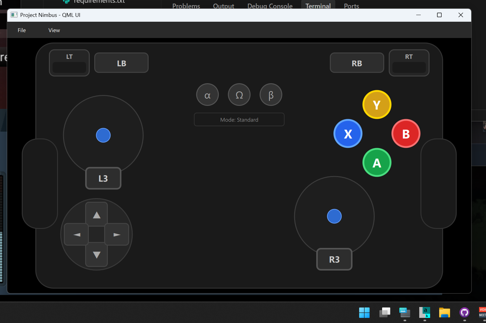
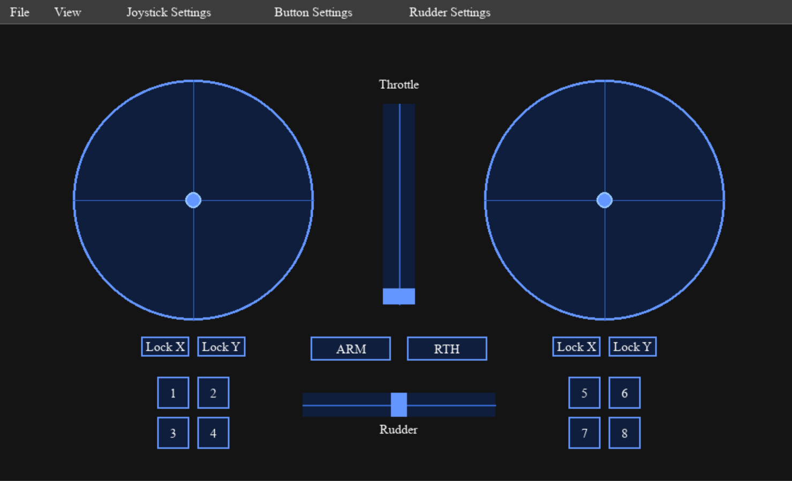
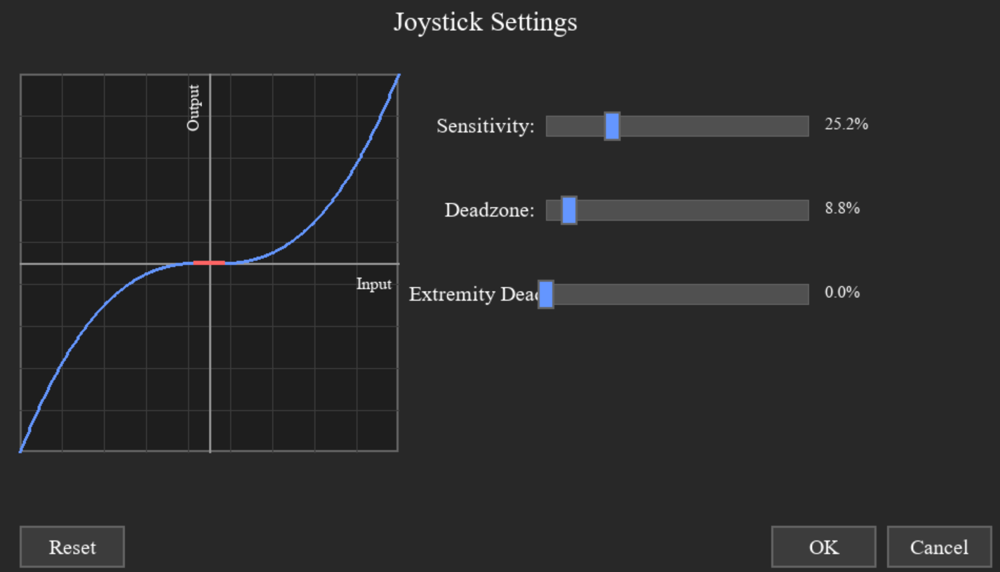
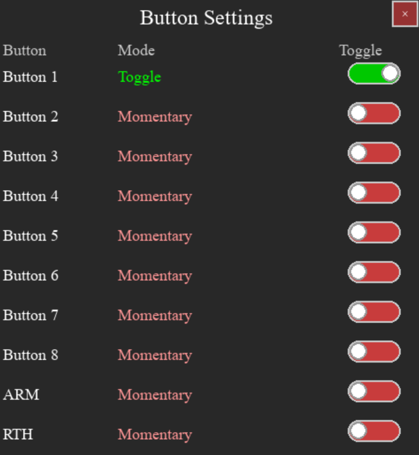

<div align="center">
  
</div>

# Project Nimbus

**Project Nimbus** is a free, open-source modular virtual controller for Windows. It transforms mouse input into virtual joystick commands via [vJoy](http://vjoystick.sourceforge.net/) (DirectInput) or [ViGEmBus](https://github.com/nefarius/ViGEmBus) (Xbox 360 XInput emulation).

Users build their own controller layout by dragging, dropping, and resizing widgets — joysticks, buttons, sliders, D-pads, and steering wheels — onto a customizable canvas. Every widget's axis mapping, sensitivity curve, deadzone, and button behavior is independently configurable.

**Designed with accessibility in mind.** Project Nimbus is a free software alternative to the Xbox Adaptive Controller, enabling people with mobility limitations to build custom controller layouts without expensive hardware. It works equally well for adaptive gaming, UAV/rover control via Mission Planner, or any application that expects joystick input.

## Adaptive Platform 2 — Custom Layout Builder

<div align="center">
  
  <p><em>Adaptive Platform 2 — modular drag-and-drop canvas: place joysticks, buttons, sliders, and D-pads anywhere on a fully customizable layout</em></p>
</div>

## Screenshots

<div align="center">
  
  <p><em>Main interface showing dual joysticks, throttle, rudder, and configurable buttons with menu bar</em></p>
</div>

<div align="center">
  
  <p><em>Joystick Settings dialog with real-time sensitivity curve visualization, deadzone, and extremity deadzone controls</em></p>
</div>

<div align="center">
  
  <p><em>Button Settings dialog showing toggle/momentary mode configuration with color-coded visual feedback</em></p>
</div>

## Features

### Core Functionality
- **Modular Layout Builder**: Drag-and-drop canvas to place joysticks, buttons, sliders, D-pads, and steering wheels anywhere
- **Dual Virtual Joysticks**: Independent axis mapping with FPS-style delta tracking and tremor filtering for wheelchair joysticks
- **Trigger/Slider Controls**: Horizontal and vertical sliders with 3 snap modes (hold, snap-to-zero, spring-to-center)
- **Button Support**: Up to 128 configurable buttons with toggle/momentary modes, color and shape options
- **Macro Joystick Mode**: Convert any joystick into a macro pad — map directions to buttons, axes, or turbo actions
- **Real-time Control**: Low-latency input processing with 60 FPS update rate
- **vJoy Integration**: DirectInput with 8 axes (X,Y,Z,RX,RY,RZ,SL0,SL1) and 128 buttons
- **ViGEm Integration**: Xbox 360 XInput emulation for games that require XInput (No Man's Sky, etc.)
- **Steam Input Support**: Works with Steam Input for XInput-compatible games

### Advanced Configuration
- **Axis Mapping Dialog**: Configure which VJoy axes each control maps to
- **Joystick Sensitivity Settings**: Adjustable response curves with visual feedback and real-time graph display
- **Rudder Sensitivity Settings**: Dedicated sensitivity curves for rudder control with deadzone configuration
- **Button Mode Configuration**: Toggle between momentary and toggle modes for each button individually
- **Individual Axis Locking**: Lock X or Y axes independently on each joystick
- **Auto-centering**: Configurable auto-center behavior for rudder control
- **JSON Configuration**: Persistent settings stored in `controller_config.json`

### Profile System
- **Default Profile**: Adaptive Platform 2 (modular canvas) opens on first launch
- **Per-Profile Settings**: Each profile stores its own joystick sensitivity, trigger sensitivity, button toggle modes, and full widget layout
- **Automatic Save**: Changes are automatically saved on every widget move, resize, or config change
- **Save Profile As**: Create new profiles with custom names and descriptions from the Widget Palette
- **Portable Profiles**: JSON-based profiles stored in user data directory for easy backup
- **Custom Layout Type**: The `custom` layout type drives the modular canvas builder

### User Interface
- **Qt Quick (PySide6 QML) UI**: Dark-themed, resizable interface with smooth animations
- **Menu System**: File menu for profiles/settings; View menu with Size presets, Game Focus Mode, and Borderless Gaming
- **Proportional Scaling**: All UI elements scale via `controller.scaled()` and View > Size presets; preference persists
- **Status Display**: vJoy/ViGEm connection status and real-time value monitoring
- **Keyboard Shortcuts**: ESC to exit, SPACE to center
- **Game Focus Mode**: Prevents Project Nimbus from stealing focus from games (Windows only)
- **Borderless Gaming**: Auto-detect games, strip window borders, and continuously release cursor lock (View → Borderless Gaming)

## Accessibility

The project was built with an accessibility-first philosophy. Instead of assuming users can handle conventional joysticks or gamepads, Nimbus allows mouse-driven or alternative inputs to control any software or hardware that supports vJoy.

This makes it especially valuable for:
- **Users with mobility impairments** who rely on mouse or adaptive devices
- **Developers creating assistive technology** solutions
- **Hobbyists and researchers** exploring human-computer interaction through unconventional inputs
- **Anyone seeking alternative control schemes** for specialized applications

## Applications

- **UAV and Rover Control**: Bridge mouse input to Mission Planner and other MAVLink-compatible ground control software with professional-grade stability features
- **Adaptive Gaming**: Play joystick-only games using a mouse-first input scheme with customizable sensitivity
- **Research and Prototyping**: Explore new input models for robotics, simulation, or accessibility tools with comprehensive configuration options
- **Assistive Technology**: Provide joystick functionality for users who cannot operate traditional controllers
- **Borderless Gaming**: Use Project Nimbus alongside borderless gaming for seamless full-screen gaming with simultaneous mouse and joystick control

## Borderless Gaming Integration

Project Nimbus includes **built-in borderless gaming integration** — no external tools needed.

**How to use**:
1. Go to **View → Borderless Gaming...**
2. Click **"Scan for Games"** — it auto-detects known games from the compatibility database
3. Select your game window, then click **"Apply Borderless + Free Cursor"** (the green button)
4. Your game fills the screen borderless, and your cursor is continuously freed so you can reach Nimbus
5. Click **"Restore Window & Stop"** when done

**What it does**:
- **Strips window decorations** and resizes the game to fill your monitor (borderless windowed mode)
- **Continuously releases ClipCursor** confinement so the game cannot lock your mouse to its window
- **Auto-detects 30+ games** from a built-in compatibility database (see Compatibility tab in the dialog)
- **Adjustable release speed** — tune the cursor release interval from 16ms (aggressive) to 200ms (gentle)

**Game compatibility**: Verified with Minecraft, Stardew Valley, Terraria, Skyrim and many others. See [`docs/GAME_COMPATIBILITY.md`](docs/GAME_COMPATIBILITY.md) for the full list.

## Game Focus Mode (Windows)

When playing games that pause or lose input when unfocused, enable **Game Focus Mode** to keep your game running while interacting with Project Nimbus.

**How it works:**
1. Go to **View > Game Focus Mode** to enable
2. When you click on Project Nimbus, it briefly takes focus to register your input
3. When you release the mouse, focus is automatically restored to the previous window (your game)

**Technical details:**
- Uses Windows API (`SetForegroundWindow` with `AttachThreadInput`) to restore focus
- Works with most games, though some that pause instantly on focus loss may still notice the brief switch
- Setting is saved and persists across sessions

**Note:** This feature is only available on Windows. On other platforms, the menu option will be disabled.

## Roadmap & Vision

Project Nimbus is evolving beyond a virtual controller into a broader **adaptive input platform**. The following directions are actively being explored and documented.

### 🎙️ Voice Command Integration
Speak to control. Buttons, axes, and macros triggered by voice — using offline engines (Faster-Whisper, Vosk) for low latency and privacy, or cloud engines for higher accuracy. Goal: act on interim results for time-critical commands.

### 🤖 Spectator+ — AI-Assisted Play
*"You direct. The AI executes."* An accessibility-first AI copilot: the user provides high-level intent (via voice, click, or switch), and a trained agent handles precise execution through the existing vJoy/ViGEm bridge. Designed for users who have the cognitive engagement to play but not the fine motor precision.

### ⌨️ Keyboard Output Mode
Any Nimbus button or slider emits native keyboard shortcuts to any application — Photoshop, DaVinci Resolve, OBS, a browser — with no external software. Enables Nimbus as a **Stream Deck replacement**, a **drawing tablet express key surface**, or a **DAW controller**.

### 🎮 Physical Hardware Integration
Nimbus can wrap existing adaptive hardware — **Xbox Adaptive Controller**, **QuadStick**, foot pedals, head trackers — reading their input via XInput/DirectInput and re-emitting through vJoy with Nimbus's sensitivity curves, macros, and voice layer applied on top.

### 🗣️ AAC — Augmentative & Alternative Communication
The same customizable button surface that controls a game can output spoken phrases via text-to-speech, navigate AAC vocabulary pages, or trigger keyboard shortcuts in dedicated AAC software. Switch access and eye gaze (Windows Eye Control already works with Nimbus today) are natural extensions.

### 📊 Research Platform
With opt-in telemetry, Nimbus could become a research instrument for understanding how people with disabilities play, in partnership with AbleGamers, Shirley Ryan AbilityLab, CMU HCII, and others.

### 🔧 Modular Control Surface
Nimbus as a universal adaptive input layer for video editing, music production, streaming, and any Windows application. Pre-built profiles for DaVinci Resolve, Photoshop, Ableton, OBS. Auto-switch profiles by active window.

### 💼 Sustainability
Project Nimbus is and will remain **free for all accessibility use**. The core — all layouts, vJoy/ViGEm, profiles, custom builder — is MIT-licensed and free forever. Advanced features (voice, AI, cloud sync) may be offered optionally in future to sustain development.

---

## Installation

### Option 1: Standalone Executable (Recommended for End Users)

1. **Download the latest release**:
   - Go to [Releases](https://github.com/owenpkent/Project-Nimbus/releases)
   - Download `Project-Nimbus-Setup-<version>.exe` (installer) or `Project-Nimbus-<version>.exe` (portable)

2. **Install the ViGEmBus driver** (for Xbox/XInput emulation — recommended):
   - Download from [ViGEmBus Releases](https://github.com/nefarius/ViGEmBus/releases)
   - Run the installer, reboot if prompted

3. **Install VJoy Driver** (optional — for DirectInput / legacy games):
   - Download and install from [VJoy Official Site](http://vjoystick.sourceforge.net/)
   - Configure VJoy device #1 with at least 6 axes (X, Y, Z, RX, RY, RZ)

4. **Run the application**:
   - Run the installer, or double-click the portable `.exe`
   - No Python installation required!

### Option 2: Run from Source (For Developers)

#### Prerequisites
1. **Python 3.8+** - Required for the application
2. **VJoy Driver** - Download and install from [VJoy Official Site](http://vjoystick.sourceforge.net/)
3. **Git** (optional) - For cloning the repository

#### Setup Instructions

1. **Clone or download the project**:
   ```bash
   git clone https://github.com/owenpkent/Project-Nimbus.git
   cd Project-Nimbus
   ```

2. **Install Python dependencies**:
   ```bash
   pip install -r requirements.txt
   ```

3. **Configure VJoy**:
   - Install VJoy driver
   - Configure VJoy device #1 with at least 6 axes (X, Y, Z, RX, RY, RZ)
   - Ensure VJoy device is enabled and available

4. **Run the application (Qt Quick UI)**:
   ```bash
   python run.py
   ```
   
   Notes:
   - The Qt Quick (QML) UI is the default and primary UI.
   - Settings persist via `controller_config.json`.

### Building Your Own Executable

See [build_tools/BUILD_EXECUTABLE.md](build_tools/BUILD_EXECUTABLE.md) for detailed instructions on creating a standalone Windows executable using PyInstaller.

## Usage

### Basic Controls
- **Mouse Drag**: Click and drag within joystick circles to control position
- **Throttle Slider**: Vertical slider for throttle control (does not auto-center)
- **Rudder Slider**: Horizontal slider for rudder control (auto-centers when released)
- **Lock Buttons**: Click "Lock X" or "Lock Y" to lock individual axes on each joystick
- **Joystick Buttons**: 8 configurable buttons (1-4 on left, 5-8 on right) with toggle/momentary modes
- **ARM Button**: Configurable ARM button (button 9) with toggle/momentary mode
- **RTH Button**: Configurable Return to Home button (button 10) with toggle/momentary mode

### Menu System
- **File > Profile**: Switch between profiles or create new ones
- **File > Save Profile / Save Profile As...**: Save current settings to profile
- **File > Settings**: Consolidated settings submenu
  - **Joystick Sensitivity**: Configure sensitivity curves for joysticks
  - **Trigger Sensitivity**: Sensitivity curves for trigger/slider controls
  - **Axis Mapping**: Assign UI controls to vJoy axes
  - **Button Modes**: Configure toggle/momentary modes for buttons
- **View > Game Focus Mode**: Keep game focused while using Nimbus (Windows)
- **View > Borderless Gaming...**: Strip game window borders and continuously release cursor lock

### Keyboard Shortcuts
- **ESC**: Exit application (or close open dialogs)
- **F1**: Toggle debug information display
- **SPACE**: Center both joysticks
- **C**: Open axis configuration dialog

### Status Indicators
- **VJoy Connection**: Shows VJoy driver connection status in real-time
- **Real-time Values**: Current joystick positions and processed values
- **Lock Status**: Visual indicators showing which axes are locked

## Profiles

Project Nimbus uses a profile system to save and manage different controller configurations. Each profile stores its own sensitivity curves, deadzones, button settings, and layout type.

### Profile Storage Location

Profiles are stored in your user data directory for easy access and backup:

| Platform | Location |
|----------|----------|
| **Windows** | `%APPDATA%\ProjectNimbus\profiles\` |
| **macOS** | `~/Library/Application Support/ProjectNimbus/profiles/` |
| **Linux** | `~/.local/share/ProjectNimbus/profiles/` |

**Quick Access**: Use **File > Open Profiles Folder...** to open the profiles directory in your file explorer.

### Profile Files

Each profile is a JSON file containing:
- **name**: Display name shown in the menu
- **description**: Optional description of the profile
- **layout_type**: UI layout (`flight_sim`, `xbox`, `adaptive`, or `custom`)
- **joystick_settings**: Sensitivity, deadzone, extremity deadzone
- **rudder_settings**: Rudder-specific sensitivity settings
- **buttons**: Button labels and toggle modes
- **axis_mapping**: VJoy axis assignments
- **custom_layout**: (custom type only) Widget array with positions, sizes, and mappings

### Backing Up Profiles

To back up your profiles:
1. Open **File > Open Profiles Folder...**
2. Copy the `.json` files to your backup location
3. To restore, copy them back to the profiles folder

### Built-in Profile

One profile is included by default:
- **Adaptive Platform 2**: Modular drag-and-drop controller builder — place joysticks, buttons, and sliders anywhere on a customizable canvas. Opens automatically on first launch.

You can create unlimited custom profiles using **File > Save Profile As...** from the Widget Palette, and open the profiles folder via **File > Open Profiles Folder...**.

## Configuration

The application uses a JSON-based configuration system stored in `controller_config.json`. The configuration is automatically created with sensible defaults on first run.

### Key Configuration Sections

#### Joystick Settings
```json
{
  "joysticks": {
    "left": {
      "dead_zone": 0.1,
      "sensitivity": 1.0,
      "curve_type": "linear",
      "curve_power": 2.0,
      "invert_x": false,
      "invert_y": false,
      "max_range": 1.0
    }
  }
}
```

#### Safety Settings
```json
{
  "safety": {
    "enable_failsafe": true,
    "failsafe_timeout": 5.0,
    "max_update_rate": 100,
    "enable_smoothing": true,
    "smoothing_factor": 0.1
  }
}
```

### Settings Dialogs

#### Joystick Settings
The Joystick Settings dialog provides comprehensive control over joystick response:
- **Sensitivity (0-100%)**: Controls the steepness of the response curve
  - 50% = Linear response
  - <50% = Flatter curve (less sensitive, more precise)
  - >50% = Steeper curve (more sensitive, faster response)
- **Deadzone (0-100%)**: Creates a dead area around center where small movements are ignored
- **Extremity Deadzone (0-100%)**: Prevents reaching absolute maximum values at the edges
- **Real-time Graph**: Visual representation of the sensitivity curve with deadzone indicators

#### Rudder Settings
Identical functionality to Joystick Settings but specifically for rudder control:
- Independent sensitivity curve configuration
- Separate deadzone and extremity deadzone settings
- Real-time visual feedback of the response curve
- Settings are applied immediately to rudder input

#### Button Settings
Configure the behavior of all 10 buttons:
- **Toggle Mode**: Button stays "pressed" until clicked again (green indicator)
- **Momentary Mode**: Button is only active while being held down (red indicator)
- **Visual Feedback**: Color-coded switches show current mode at a glance
- **Individual Configuration**: Each button (1-8, ARM, RTH) can be set independently

### Sensitivity Curves
The sensitivity curve system provides precise control over input response:
- **Linear (50%)**: Direct 1:1 response
- **Flatter Curves (<50%)**: More precise control near center, exponential scaling
- **Steeper Curves (>50%)**: Faster response near center, logarithmic scaling
- **Deadzone Integration**: Curves work seamlessly with deadzone settings
- **Real-time Preview**: See exactly how your settings affect the response curve

## Architecture

### Project Structure
```
Project-Nimbus/
├── qml/                               # QML UI (Qt Quick)
│   ├── Main.qml                       # Main window, menus, layout loader
│   ├── layouts/                       # Layout QML files
│   │   ├── FlightSimLayout.qml        # Dual joysticks + throttle/rudder
│   │   ├── XboxLayout.qml             # Standard Xbox gamepad
│   │   ├── AdaptiveLayout.qml         # Accessibility-focused fixed layout
│   │   └── CustomLayout.qml           # Modular drag-and-drop canvas
│   └── components/                    # Reusable QML controls
│       ├── Joystick.qml               # Virtual joystick
│       ├── DraggableWidget.qml        # Drag/resize wrapper for any widget
│       ├── WidgetPalette.qml          # Sidebar toolbar for adding widgets
│       ├── SliderVertical.qml         # Throttle slider
│       ├── SliderHorizontal.qml       # Rudder slider
│       ├── NumberPad.qml              # Button grid
│       ├── BorderlessGamingDialog.qml # Borderless gaming & cursor release UI
│       └── MacroEditorDialog.qml      # Macro joystick zone editor
├── src/
│   ├── qt_qml_app.py                  # QML application entry
│   ├── bridge.py                      # Python↔QML bridge (ControllerBridge)
│   ├── config.py                      # Configuration & profile management
│   ├── qt_dialogs.py                  # Qt Widgets settings dialogs
│   ├── vjoy_interface.py              # vJoy driver interface (8 axes, 128 buttons)
│   ├── vigem_interface.py             # ViGEm Xbox 360 controller emulation
│   ├── window_utils.py                # Game Focus Mode (Windows API)
│   ├── borderless.py                  # Borderless gaming & cursor release
│   └── legacy/                        # Legacy pygame UI (reference only)
├── profiles/                          # Bundled profile JSON files
│   └── adaptive_platform_2.json       # Default modular custom layout
├── docs/                              # Documentation
│   ├── GAME_COMPATIBILITY.md          # Borderless gaming game list
│   ├── architecture/                  # Technical architecture docs
│   ├── development/                   # Developer & AI assistant notes
│   ├── setup/                         # Installation & packaging guides
│   └── accessibility/
├── build_tools/                       # PyInstaller build system
├── research/                          # Research notes
├── run.py                             # Launcher with venv + dependency checks
├── run.bat                            # Windows batch launcher
├── requirements.txt                   # Python dependencies
├── controller_config.json             # Runtime settings (auto-generated)
├── logo.png
├── docs/screenshots/
├── tests/
└── README.md
```

### Recent Changes (QML Migration)
- Migrated UI to Qt Quick (PySide6 QML) with a dark top menu bar.
- Standardized sizes using `controller.scaled(...)` for consistent, DPI-aware scaling.
- Joystick, throttle, rudder input behavior:
  - No jump-to-click; dragging is relative.
  - Joystick and rudder smoothly return to center on release; throttle does not auto-center.
- Throttle widened; rudder taller; refined animations.
- NumberPad and ARM/RTH buttons use dark styling with blue pressed/checked state.
- Optional debug borders for layout tuning.

### Key Components

#### `VJoyInterface`
Manages communication with the VJoy driver including:
- Device initialization and management
- Axis value updates
- Failsafe monitoring
- Error handling and recovery

#### `ControllerConfig`
Configuration management system providing:
- JSON-based configuration storage
- Sensitivity curve processing
- Dead zone calculations
- Configuration validation

## Safety Features

### Failsafe System
- **Automatic Activation**: Triggers if no commands received within timeout period
- **Emergency Stop**: Manual emergency stop button
- **Axis Centering**: Automatically centers all axes during failsafe
- **Visual Indicators**: Clear status display when failsafe is active

### Rate Limiting
- **Update Rate Control**: Prevents excessive update rates
- **Safety Limits**: Hard limits on maximum update frequency
- **Smooth Operation**: Ensures stable operation under all conditions

### Error Handling
- **VJoy Connection Monitoring**: Continuous monitoring of VJoy driver status
- **Graceful Degradation**: Continues operation even if VJoy is unavailable
- **Comprehensive Logging**: Detailed error reporting and status information

## Troubleshooting

### Common Issues

#### VJoy Not Detected
- Ensure VJoy driver is properly installed
- Check that VJoy device #1 is configured and enabled
- Verify VJoy device has sufficient axes configured
- Run application as administrator if needed

#### Poor Responsiveness
- Check `update_rate` setting in configuration
- Reduce `smoothing_factor` for more responsive control
- Verify system performance and close unnecessary applications

#### Joystick Drift
- Increase `dead_zone` values in configuration
- Check for hardware interference (other controllers)
- Verify mouse sensitivity settings

### Debug Mode
Press F1 to enable debug mode, which displays:
- Current configuration values
- Update rates and timing information
- Detailed joystick position data
- VJoy driver status

## Development

### Code Style
- **PEP 8 Compliance**: All code follows Python PEP 8 style guidelines
- **Type Hints**: Comprehensive type annotations for better code clarity
- **Documentation**: Detailed docstrings for all classes and methods
- **Error Handling**: Robust error handling throughout the application

### Testing
- **Configuration Validation**: Built-in configuration validation
- **Failsafe Testing**: Comprehensive failsafe system testing
- **Edge Case Handling**: Proper handling of edge cases and error conditions

### Extension Points
- **Custom Sensitivity Curves**: Easy to add new curve types
- **Additional Input Methods**: Framework supports multiple input types
- **Plugin Architecture**: Modular design allows for easy extensions

## Alternative Shell

An optional Qt Widgets-based shell is available for experimentation:

- `src/qt_main.py`: Alternative interface implemented with Qt Widgets. It is not used by the default launcher and is not maintained at feature parity with the QML UI. The primary UI remains the Qt Quick (QML) app launched via `run.py`.

## Legacy
Legacy pygame-based UI and dialogs are kept under `src/legacy/` for reference only and are not used by the QML app launched via `run.py`.

## Adaptive Platform 2 — Custom Layout Builder

The **Adaptive Platform 2** profile introduces a modular controller builder where users can design their own controller layout:

### How It Works
1. Open Adaptive Platform 2 (loads automatically on first launch)
2. Click **"Edit Layout"** (bottom-right corner) to enter edit mode
3. **Drag** widgets to reposition, **corner handle** to resize, **×** to delete
4. **Double-click** any widget to configure (label, axis mapping, button ID, color)
5. Use the **Widget Palette** sidebar to add new joysticks, buttons, or sliders
6. Click **"Done Editing"** to save and return to play mode

### Available Widgets
| Widget | Description |
|--------|-------------|
| **Joystick** | 2-axis analog stick with triple-click mouse lock (maps to any axis pair) |
| **Button** | Single press with toggle/momentary support and color/shape options (maps to any vJoy button 1-128) |
| **Slider** | Single-axis analog control with horizontal/vertical orientation and 3 snap modes: hold position, snap to zero, snap to center |
| **D-Pad** | 4-directional digital button cluster with auto-assigned button IDs |
| **Steering Wheel** | Rotational single-axis input with spoke indicator |

### Hardware Limits
| Backend | Axes | Joysticks | Buttons |
|---------|------|-----------|---------|
| **vJoy** | 8 (X,Y,Z,RX,RY,RZ,SL0,SL1) | Up to 4 | Up to 128 |
| **ViGEm** (Xbox) | 4 + 2 triggers | 2 | 14 |

See [`docs/development/WIDGET_IDEAS.md`](docs/development/WIDGET_IDEAS.md) for planned accessibility widgets including dwell buttons, scan mode strips, steering wheels, and more.

See [`docs/architecture/`](docs/architecture/) for detailed technical documentation of the custom layout system.

## Changelog

See [CHANGELOG.md](CHANGELOG.md) for the full version history.

## Contributing

Contributions are welcome! To get started:

1. Fork the repository
2. Create a feature branch (`git checkout -b feature/my-feature`)
3. Make your changes — follow existing code style, add docstrings for new functions
4. Run tests: `python -m pytest tests/`
5. Submit a pull request with a clear description

For larger changes or new feature ideas, open an issue first to discuss approach.

See [`docs/development/INTEGRATION_GUIDE.md`](docs/development/INTEGRATION_GUIDE.md) for architecture notes useful for contributors.

## License

MIT License — see [LICENSE](LICENSE) for details. Free for all use including accessibility and educational purposes.
