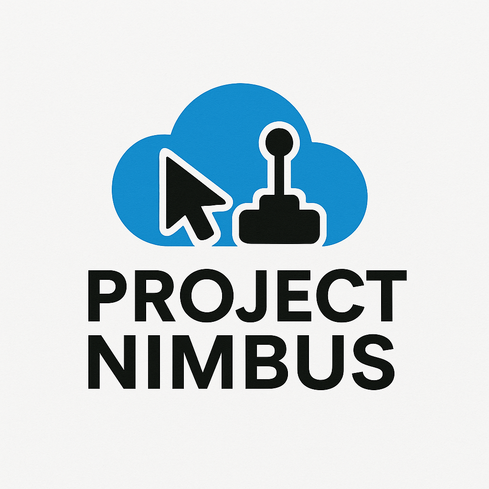

<div align="center">
  
</div>

# Project Nimbus

Project Nimbus is a Python-based virtual controller interface that transforms mouse input into virtual joystick commands via the vJoy driver. It provides a comprehensive dual-joystick layout with throttle, rudder controls, and configurable button mapping.

It is designed with accessibility in mind, offering a practical solution for individuals with mobility limitations who may not be able to use traditional physical controllers. By providing a mouse-first input model, it enables users to interact with systems that expect joystick input.

At the same time, Project Nimbus is versatile enough for anyone interested in alternative control schemes. Whether for adaptive gaming or connecting to Mission Planner for UAV and rover control, Nimbus makes joystick input more flexible and inclusive.

## Features

### Core Functionality
- **Dual Virtual Joysticks**: Left and right joystick controls with independent axis mapping
- **Throttle & Rudder Controls**: Dedicated vertical throttle slider and horizontal rudder slider
- **8-Button Support**: Configurable joystick buttons (4 per stick) with VJoy integration
- **Real-time Control**: Low-latency input processing with 60 FPS update rate
- **Emergency Systems**: Emergency stop button and center-all functionality
- **VJoy Integration**: Direct communication with vJoy driver for seamless compatibility

### Advanced Configuration
- **Axis Mapping Dialog**: Configure which VJoy axes each control maps to
- **Sensitivity Curves**: Adjustable response curves with visual feedback
- **Individual Axis Locking**: Lock X or Y axes independently on each joystick
- **Auto-centering**: Configurable auto-center behavior for rudder control
- **JSON Configuration**: Persistent settings stored in `controller_config.json`

### User Interface
- **Pygame-based GUI**: Responsive interface with real-time visual feedback
- **Menu System**: File menu with configuration dialogs and settings
- **Status Display**: VJoy connection status and real-time value monitoring
- **Debug Mode**: Comprehensive system information (F1 to toggle)
- **Keyboard Shortcuts**: ESC to exit, SPACE to center, F1 for debug info

## Accessibility

The project was built with an accessibility-first philosophy. Instead of assuming users can handle conventional joysticks or gamepads, Nimbus allows mouse-driven or alternative inputs to control any software or hardware that supports vJoy.

This makes it especially valuable for:
- **Users with mobility impairments** who rely on mouse or adaptive devices
- **Developers creating assistive technology** solutions
- **Hobbyists and researchers** exploring human-computer interaction through unconventional inputs
- **Anyone seeking alternative control schemes** for specialized applications

## Applications

- **UAV and Rover Control**: Bridge mouse input to Mission Planner and other MAVLink-compatible ground control software with professional-grade stability features
- **Adaptive Gaming**: Play joystick-only games using a mouse-first input scheme with customizable sensitivity
- **Research and Prototyping**: Explore new input models for robotics, simulation, or accessibility tools with comprehensive configuration options
- **Assistive Technology**: Provide joystick functionality for users who cannot operate traditional controllers

## Installation

### Prerequisites
1. **Python 3.8+** - Required for the application
2. **VJoy Driver** - Download and install from [VJoy Official Site](http://vjoystick.sourceforge.net/)
3. **Git** (optional) - For cloning the repository

### Setup Instructions

1. **Clone or download the project**:
   ```bash
   git clone <repository-url>
   cd Project-Nimbus
   ```

2. **Install Python dependencies**:
   ```bash
   pip install -r requirements.txt
   ```

3. **Configure VJoy**:
   - Install VJoy driver
   - Configure VJoy device #1 with at least 6 axes (X, Y, Z, RX, RY, RZ)
   - Ensure VJoy device is enabled and available

4. **Run the application**:
   ```bash
   python run.py
   ```
   
   Or alternatively:
   ```bash
   python main.py
   ```
   
   **Note**: `run.py` is recommended as it handles virtual environment setup and dependency management automatically.

## Usage

### Basic Controls
- **Mouse Drag**: Click and drag within joystick circles to control position
- **Throttle Slider**: Vertical slider for throttle control (does not auto-center)
- **Rudder Slider**: Horizontal slider for rudder control (auto-centers when released)
- **Lock Buttons**: Click "Lock X" or "Lock Y" to lock individual axes on each joystick
- **Reset Buttons**: Click "RESET" to center individual joysticks
- **Joystick Buttons**: 8 configurable buttons (4 per joystick) that send to VJoy
- **Center All**: Centers both joysticks and resets throttle/rudder
- **Emergency Stop**: Immediately centers all controls and activates failsafe

### Menu System
- **File > Configure Axes**: Open axis mapping dialog to assign VJoy axes
- **Joystick Settings**: Configure sensitivity curves and response settings

### Keyboard Shortcuts
- **ESC**: Exit application (or close open dialogs)
- **F1**: Toggle debug information display
- **SPACE**: Center both joysticks
- **C**: Open axis configuration dialog

### Status Indicators
- **VJoy Connection**: Shows VJoy driver connection status in real-time
- **Real-time Values**: Current joystick positions and processed values
- **Lock Status**: Visual indicators showing which axes are locked

## Configuration

The application uses a JSON-based configuration system stored in `controller_config.json`. The configuration is automatically created with sensible defaults on first run.

### Key Configuration Sections

#### Joystick Settings
```json
{
  "joysticks": {
    "left": {
      "dead_zone": 0.1,
      "sensitivity": 1.0,
      "curve_type": "linear",
      "curve_power": 2.0,
      "invert_x": false,
      "invert_y": false,
      "max_range": 1.0
    }
  }
}
```

#### Safety Settings
```json
{
  "safety": {
    "enable_failsafe": true,
    "failsafe_timeout": 5.0,
    "max_update_rate": 100,
    "enable_smoothing": true,
    "smoothing_factor": 0.1
  }
}
```

### Sensitivity Curves
- **Linear**: Direct 1:1 response
- **Exponential**: More precise control near center, faster at edges
- **Logarithmic**: Faster response near center, more precise at edges

## Architecture

### Project Structure
```
Project-Nimbus/
├── main.py                    # Main application entry point
├── run.py                     # Launcher script with auto-setup
├── config.py                  # Configuration management system
├── virtual_joystick.py        # Virtual joystick implementation
├── vjoy_interface.py          # VJoy driver interface wrapper
├── axis_config_dialog.py      # Axis mapping configuration dialog
├── joystick_settings_dialog.py # Sensitivity and curve settings dialog
├── sensitivity_dialog.py      # Sensitivity configuration utilities
├── test_dialog.py            # Testing and validation utilities
├── simple_vjoy_test.py       # Simple VJoy connection test
├── test_vjoy.py              # Comprehensive VJoy testing
├── requirements.txt          # Python dependencies
├── run.bat                   # Windows batch launcher
├── logo.png                  # Project logo
└── README.md                # This documentation
```

### Key Classes

#### `VirtualControllerApp`
Main application class handling the GUI, event processing, and coordination between components.

#### `VirtualJoystick`
Handles individual joystick logic including:
- Mouse input processing
- Position calculations
- Visual rendering
- Lock/unlock functionality

#### `VJoyInterface`
Manages communication with the VJoy driver including:
- Device initialization and management
- Axis value updates
- Failsafe monitoring
- Error handling and recovery

#### `ControllerConfig`
Configuration management system providing:
- JSON-based configuration storage
- Sensitivity curve processing
- Dead zone calculations
- Configuration validation

## Safety Features

### Failsafe System
- **Automatic Activation**: Triggers if no commands received within timeout period
- **Emergency Stop**: Manual emergency stop button
- **Axis Centering**: Automatically centers all axes during failsafe
- **Visual Indicators**: Clear status display when failsafe is active

### Rate Limiting
- **Update Rate Control**: Prevents excessive update rates
- **Safety Limits**: Hard limits on maximum update frequency
- **Smooth Operation**: Ensures stable operation under all conditions

### Error Handling
- **VJoy Connection Monitoring**: Continuous monitoring of VJoy driver status
- **Graceful Degradation**: Continues operation even if VJoy is unavailable
- **Comprehensive Logging**: Detailed error reporting and status information

## Troubleshooting

### Common Issues

#### VJoy Not Detected
- Ensure VJoy driver is properly installed
- Check that VJoy device #1 is configured and enabled
- Verify VJoy device has sufficient axes configured
- Run application as administrator if needed

#### Poor Responsiveness
- Check `update_rate` setting in configuration
- Reduce `smoothing_factor` for more responsive control
- Verify system performance and close unnecessary applications

#### Joystick Drift
- Increase `dead_zone` values in configuration
- Check for hardware interference (other controllers)
- Verify mouse sensitivity settings

### Debug Mode
Press F1 to enable debug mode, which displays:
- Current configuration values
- Update rates and timing information
- Detailed joystick position data
- VJoy driver status

## Development

### Code Style
- **PEP 8 Compliance**: All code follows Python PEP 8 style guidelines
- **Type Hints**: Comprehensive type annotations for better code clarity
- **Documentation**: Detailed docstrings for all classes and methods
- **Error Handling**: Robust error handling throughout the application

### Testing
- **Configuration Validation**: Built-in configuration validation
- **Failsafe Testing**: Comprehensive failsafe system testing
- **Edge Case Handling**: Proper handling of edge cases and error conditions

### Extension Points
- **Custom Sensitivity Curves**: Easy to add new curve types
- **Additional Input Methods**: Framework supports multiple input types
- **Plugin Architecture**: Modular design allows for easy extensions

## License

This project is licensed under the MIT License - see the LICENSE file for details.

## Contributing

1. Fork the repository
2. Create a feature branch
3. Make your changes with proper documentation
4. Add tests for new functionality
5. Submit a pull request

## Support

For issues, questions, or contributions, please refer to the project's issue tracker or documentation.

---

**Note**: This software is designed for educational and development purposes. When using for actual drone control, always follow proper safety protocols and local regulations.
